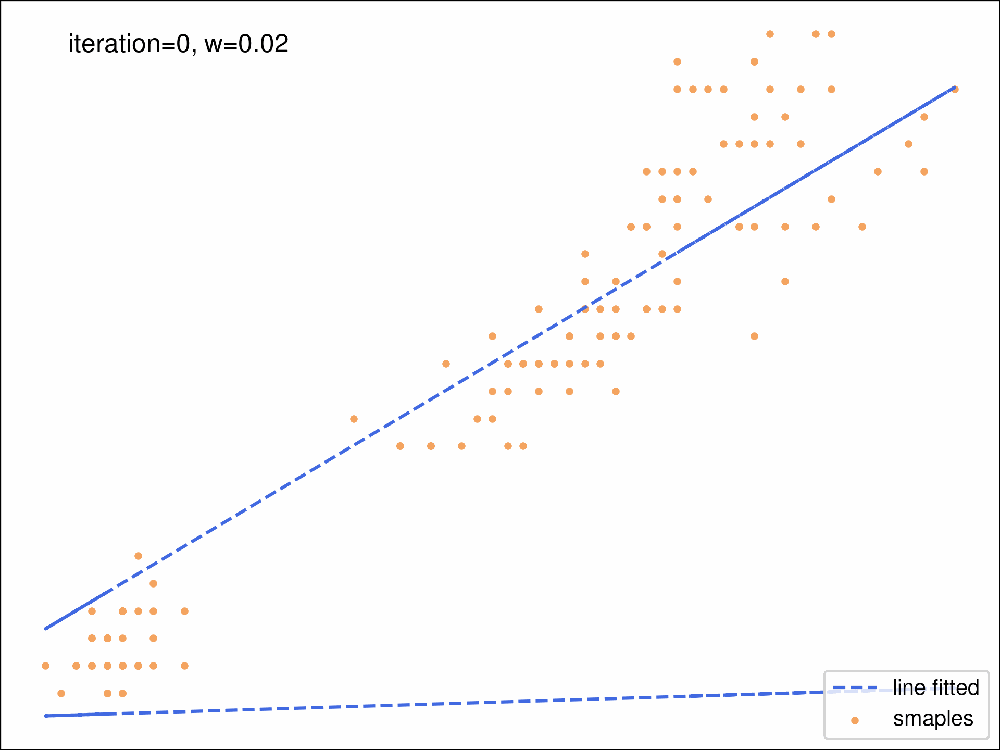

# Mini-Project 11: Machine Learning Basic Algorithms From Scratch

## Summary
Algorithms list:

1. k-means;
2. Gradient Descending Algorithm 
## Introduction

## Method
1. k means algorithm;
2. Gradient Descending Algorithm 

## Results and Discussion
* k-means results

	
    

Confusion matrix (left); Centroids pathways while updating (right). {\color{red} $\star$} refers initial points of k means; 'x' refers wrong prediction.

* Gradient Descending Algorithm and it's performance while discovering iris pedal width and length

	

Learning rate: $0.0001$ and $eps=0.01$

## Reproducibility

### Dependencies
I test these codes on linux systerm (Ubuntu 22.04). I tried to make these codes only depend on numpy. These are basic python libararies, thus it should work if you computer can use python3.

* python3;
* python libraries: numpy.
### Usage

## Conclusion

Deliverables:
* **k means algorithm**: k-means algorithm is an perfect example to excersice EM, so I wrote k means from scatch;

*Acknowledgement*

This mini project started from Dec. 2022, and will be update once a week until project completed. Now, it is still onging. If you have any questions or want to share your ideas, do not hesitate to contact me by email. If you find problems in the code, welcome to send a pull request. Thanks.