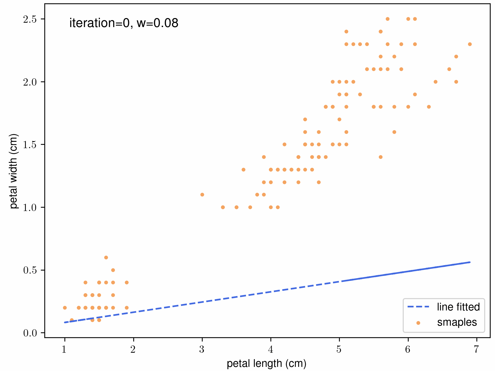
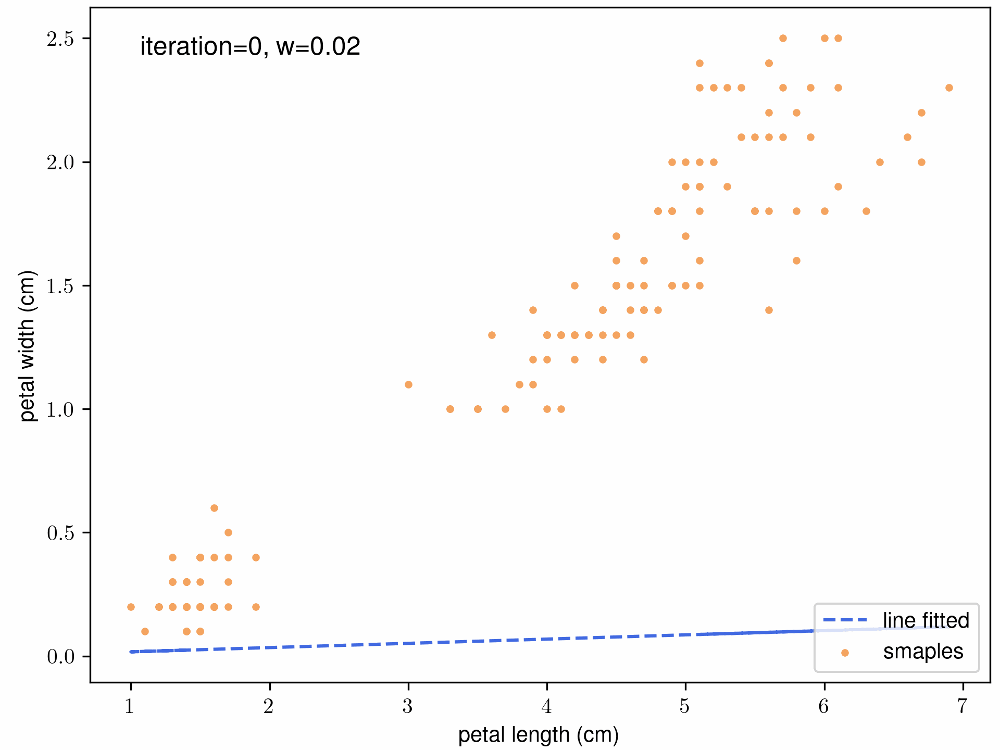

# Machine Learning Basic Algorithms From Scratch

*[An Introduction to Python-based MRI Data Analysis](https://github.com/zhangerjun/Introduction_To_Python-based_Biomedical_Data_Analysis): mini-project VIII/VIII*

## Introduction
*Motivation*

1. k-means: I have some data, I want to explore them and try to look for some potential models behind it.
2. Gradient Descending Algorithm: With complex loss function, can I find some solutions quickly?
3. Multi-core computation: With large dataset, machine learning takes long time to run. If I could take advantage of my multi-core computer, that will save a lot of time.

## Method
1. k means algorithm;
2. Gradient Descending Algorithm 
3. Multi-core computation

## Results and Discussion
* k-means results

	
    

Confusion matrix (left); Centroids pathways while updating (right). {\color{red} $\star$} refers initial points of k means; 'x' refers wrong prediction.

* Gradient Descending Algorithm and it's performance while discovering iris pedal width and length

	
	

Left: $lr = 0.0001$ and $eps=0.01$; right: $lr = 0.0005$ and $eps=0.01$.

* Multi-core processing

	

## Reproducibility

### Dependencies
I test these codes on linux systerm (Ubuntu 22.04). I tried to make these codes only depend on numpy. These are basic python libararies, thus it should work if you computer can use python3.

* python3;
* python libraries: numpy.
### Usage

## Conclusion

Deliverables:
* **k means algorithm**: k-means algorithm can help research to discover their data at the beginning, so I wrote k means from scatch;
* **Gradient Descent algorithm**: gradient descent method is widely used in aspect of machine learning, it is necessary to build it from scratch at the beginning;
* **EM algorithm**: EM algorithm is useful for hidden unknowns optimization, k-means algorithm is an perfect example to excersice EM;
* **Multi core processing**: deal with big data, expecially long dataset, multi core processing can save a lot of time.

*Acknowledgement*

This mini project started from Dec. 2022, and it is still onging currently. If you have any questions or want to share your ideas, do not hesitate to contact me by email. If you find problems in the code, welcome to send a pull request.Thanks.